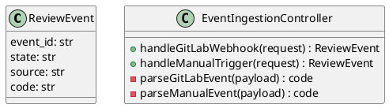
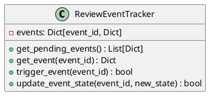
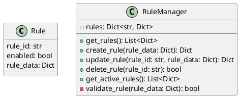
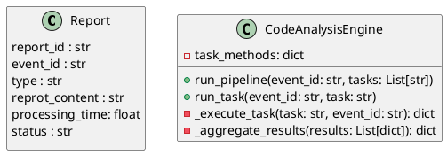
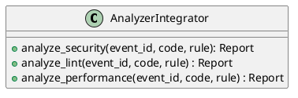
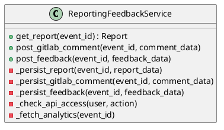
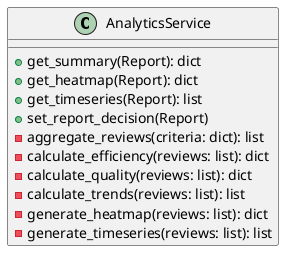

# 系统组件设计文档

## 1. Webhook & Event Ingestion

### 类图（PlantUML）

### 设计说明

Class Name: ReviewEvent

Responsibilities:
- ReviewEvent represents a single code review or analysis event.
- It is the core lifecycle entity of the system and flows through event ingestion, tracking, analysis, reporting, and analytics.
- The entity provides a stable identifier and explicit state, enabling consistent lifecycle management across modules.

Class Name: EventIngestionController

Responsibilities:
- Exposes two HTTP endpoints: POST /api/webhook/gitlab and POST /api/event/manual-trigger.
- Receives all inbound requests for webhook (GitLab) or manual event triggers.
- Validates incoming request data, including basic signature or authentication when applicable.
- Parses the payloads for both GitLab and manual events.
- Forwards the parsed and verified event objects to the review lifecycle logic (e.g., via method call or event emitter).
- Handles errors such as malformed payloads or invalid authentication and responds with the appropriate HTTP status and message.

---

## 2. Review/Event Tracking

### 类图（PlantUML）

### 设计说明

Class: ReviewEventTracker

Responsibilities:
- Manages the complete lifecycle and state tracking of review events within the system.
- Maintains an internal storage of event records. The structure is minimal—events are stored as dictionaries or similar simple records, each containing at least 'event_id', 'state', and optional 'metadata'.
- Exposes all operational functionalities as class methods. Specifically, these methods include:
  - get_pending_events(): Returns a list of events that are pending action.
  - get_event(event_id): Retrieves a specific event record by its ID.
  - trigger_event(event_id): Initiates or processes the corresponding event, possibly triggering downstream analysis or actions.
  - update_event_state(event_id, new_state): Sets an event’s state to a new value, provided the state transition is valid.
- Provides event and review queries, state transitions, and work/task triggering, all within a single class due to the simple requirements.

Rationale:
- The class embodies maximum simplicity, eschewing unnecessary patterns or extra indirection. All responsibilities are gathered in a single class as advanced per-event behavior is not required, nor is there a need for extra separation of concerns. This matches the minimal, direct design constraints for the platform’s review/event tracking component.

---

## 3. Rule Management

### 类图（PlantUML）

Class Name: Rule

Responsibilities:
- Represents a configurable code review rule used by the analysis pipeline.
- Encapsulates rule identity, enablement status, and rule configuration.
- Supports rule creation, update, deletion, and activation management.

class RuleManager: rule_id, rule_data

### 设计说明

The RuleManager class encapsulates all logic and data needed to manage code review rules within the system. It provides a set of public methods for CRUD operations:

- get_rules(): Retrieves the full list of rules, mapped to the GET /api/rules endpoint.
- create_rule(rule_data): Adds a new rule, mapped to POST /api/rules.
- update_rule(rule_id, rule_data): Updates an existing rule, mapped to PUT /api/rules/{rule_id}.
- delete_rule(rule_id): Removes a rule, mapped to DELETE /api/rules/{rule_id}.
- get_active_rules(): Supplies all currently active rules for use in other components, particularly the analysis pipeline.

Internal details include:
- validate_rule(**rule_data**): A private validation method used during create and update to ensure rule data validity.
- rules: The internal storage structure, implemented as a dictionary mapping rule IDs to their corresponding rule data.

The class is intentionally minimal and directly reflects the requirements with no additional abstractions, since the rule data structure is simple. All state and behavior regarding rules is contained within this single class, and rules are stored in a straightforward dictionary unless future complexity requires more involved modeling.

---

## 4. Code Analysis Engine

### 类图（PlantUML）

### 设计说明
class Report

Responsibilities:
- Represents the result of a single analysis task executed for a review event.
- Captures execution status.
- Serves as a standardized internal structure for result aggregation, reporting, and analytics.
- Record the results of task execution as a Report

Class: CodeAnalysisEngine

Responsibility:
- Core class orchestrating the entire code analysis pipeline for the 代码审查管理平台 (Code Review Management Platform).
- Implements two main public interfaces:
  - run_pipeline(event_id: str, tasks: List[str])  -> Report: Orchestrates execution of multiple tasks in a defined sequence, aggregating the results, and generate a report. Record the final result in a Report.
  - run_task(event_id: str, task: str) -> Report: Facilitates execution of a single analysis task, and generate a report. Record the final result in a Report.
- Handles all logic for task sequencing, execution, and aggregation of results.
- Maintains an internal mapping (task_methods) from task names to their corresponding execution methods.
- Private methods include:
  - _execute_task(task: str, event_id: str): Internal logic to run an individual analysis task by looking up and invoking the appropriate method.
  - _aggregate_results(results: List[dict]): Aggregates a list of task results into a single summary dictionary output.
- Simplicity and encapsulation are prioritized: all orchestration and core functionality reside within this class, leveraging Python dictionaries for results and method mapping to avoid unnecessary abstractions.
- No extra 'Task', 'Result', or manager/handler classes are defined, as the requirements can be satisfied entirely by CodeAnalysisEngine itself.
- Clear focus is placed on internal orchestration and exposing a clean, minimal interface for use by other components.

---

## 5. Analyzer Integrators

### 类图（PlantUML）

### 设计说明

Class AnalyzerIntegrator

Responsibilities:
- Provides synchronous methods for analyzing code in the context of security, lint, and performance.
- Each method implements the code analysis logic for its respective domain.
- Receives an event_id (to track which review or pipeline event triggered the check) and the code, the rule to analyze.
- Returns the analysis result as an report.

Public Methods:
- analyze_security(event_id, code, rule) -> Report: Runs synchronous security analysis on the given code.
- analyze_lint(event_id, code, rule) -> Report: Performs code linting checks.
- analyze_performance(event_id, code, rule) -> Report: Analyzes code for performance issues.

---

## 6. Reporting & Feedback

### 类图（PlantUML）

### 设计说明

Class: ReportingFeedbackService

Responsibilities:
- Handles all API endpoints for the Reporting & Feedback component of the code review system.
- Persists and retrieves code review results tied to a specific event.
- Automates creation and posts merge request comments (e.g., on GitLab).
- Ingests and stores developer feedback related to particular code review events.
- Performs basic security and configuration checks for API access controls.

Notes:
- All data persistence operations are handled within methods, either directly or via provided framework tools.
- No separate data model or transfer classes are defined unless specifically required by implementation language/framework (such as API request parsing or ORM usage), and simple dictionaries or framework-defined structures should be used.
- API endpoints map directly to public class methods:
  - get_report(event_id): Retrieves the report for a given event.
  - post_gitlab_comment(event_id, comment_data): Posts a code review comment for a given event.
  - post_feedback(event_id, feedback_data): Ingests and stores feedback for a given event.
- Supporting functionality like persistence, security checks, and analytics are encapsulated in private methods.
- Justification for the design is rooted in minimalism and clarity: a single class houses all related responsibilities, with no helpers, managers, or data transfer objects unless strictly necessary. The responsibilities center on a single domain (code review events) and associated operations.

---

## 7. Analytics & Statistics

### 类图（PlantUML）

### 设计说明

class AnalyticsService

Responsibility:
Aggregates code review and feedback data, computes analytics (efficiency, trends, quality metrics), and exposes methods for the three analytics endpoints:
- get_summary(Report) for /api/analytics/summary
- get_heatmap(Report) for /api/analytics/heatmap
- get_timeseries(Report) for /api/analytics/timeseries
- set_report_decision(Report) for /api/analytics/feedback

- set_report_decision(Report): Applies a user decision (e.g. accept or reject) to a generated analytics report by updating its status. This method is triggered by explicit user action from the frontend and finalizes the consumption outcome of the report.

